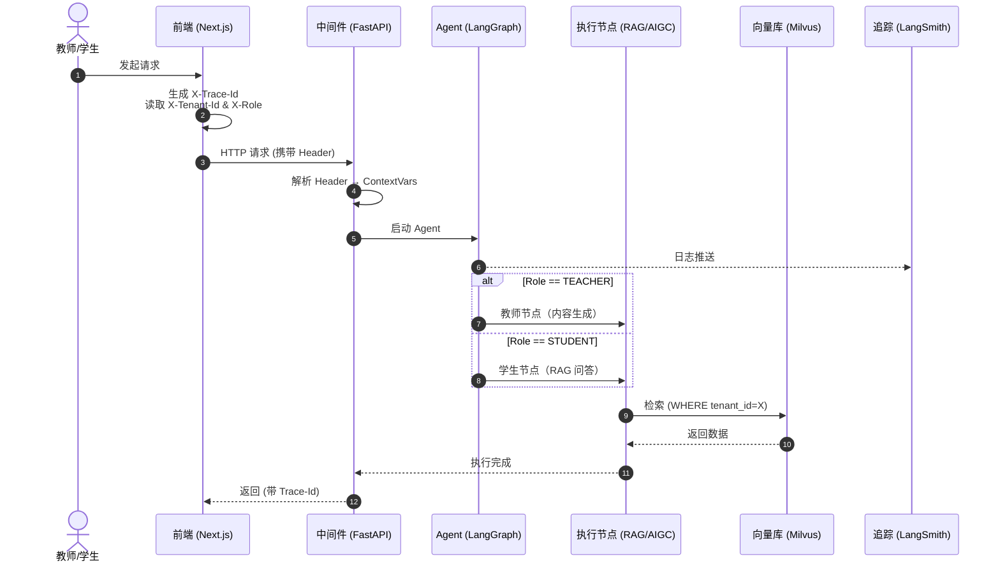

# 高校教师数字分身系统 (Academic Persona)

**版本：** 2.0  
**目标：** 构建具备多租户隔离、身份动态切换、全链路追溯能力的 Agent 系统

---

## 一、业务需求

### 1.1 老师端功能

| 需求 | 前端实现 | 后端实现 |
|------|----------|----------|
| 创建自己的分身 | 分身设定表单（性格、语气、口头禅） | 存储到 `Teacher_Profiles` 表，作为 Agent System Prompt |
| 添加学术成果与课件 | 文件上传组件（PDF/PPTX） | LangChain 解析 → 切分 → 存入 Milvus 向量库 |
| 广播作业（区分班级） | 发送广播面板 + 班级选择器 | 广播记录到 `Broadcast_Logs`，按班级隔离 |
| 广播研究成果 | 一键生成科研战报推送 | LLM 总结 → WebSocket 推送到学生 Feed |
| 生成短视频/海报/小红书 | AIGC 宣发工作台 | LCEL 链：文案生成 → DALL-E/HeyGen 生成多媒体 |

### 1.2 学生端功能

| 需求 | 前端实现 | 后端实现 |
|------|----------|----------|
| 绑定班级 | 输入班级邀请码 | `User_Roles` 表绑定 `user_id` 和 `class_id` |
| 订阅老师 | 浏览老师主页点击关注 | 建立订阅关系，首页拉取广播 |
| 课下提问 | ChatGPT 风格对话窗口 | RAG 检索（按班级+老师隔离）→ 流式回答 |

---

## 二、技术架构

### 2.1 技术栈

- **Runtime:** Python 3.13+ (Conda: `academic_persona`)
- **Backend:** FastAPI + LangChain 1.2.0 + LangGraph
- **Frontend:** Next.js 14+ (App Router) + Tailwind CSS
- **Tracing:** LangSmith + Local Structured Logs
- **Database:** Milvus (Vector) + PostgreSQL (Relational)

### 2.2 项目目录结构

```
.
├── backend/
│   ├── app/
│   │   ├── api/                   # 路由层
│   │   ├── core/                  # 中间件/配置
│   │   ├── ai/                    # AI 核心逻辑
│   │   │   ├── agents/            # LangGraph 状态机
│   │   │   ├── tools/             # 检索器与工具
│   │   │   └── prompts/           # 提示词模板
│   │   └── models/                # Pydantic & SQLAlchemy 模型
│   ├── environment.yml
│   └── main.py
└── frontend/
    ├── src/
    │   ├── app/                   # Next.js App Router
    │   ├── components/            # UI 组件
    │   └── lib/                   # API 拦截器
    └── package.json
```

### 2.3 请求流转架构



---

## 三、数据库设计

### 3.1 关系型数据库 (PostgreSQL)

- `User` - 用户表：`id`, `username`, `role`
- `Teacher_Profile` - 分身设定：`id`, `user_id`, `avatar_prompt`
- `Class` - 班级表：`id`, `teacher_id`, `class_name`, `invite_code`
- `Student_Class_Mapping` - 班级绑定：`student_id`, `class_id`
- `Broadcast_Message` - 广播表：`id`, `teacher_id`, `target_class_id`, `content`, `type`

### 3.2 向量数据库 (Milvus)

元数据字段：
- `tenant_id` - 所属老师（隔离）
- `doc_type` - 文档类型（`academic_paper` / `course_slide`）
- `visibility` - 可见性（全体 / 特定班级）

---

## 四、核心代码实现

### 4.1 追溯中间件 (`backend/app/core/tracing.py`)

```python
import uuid
from contextvars import ContextVar
from fastapi import Request

trace_id_ctx = ContextVar("trace_id", default="")
tenant_id_ctx = ContextVar("tenant_id", default="")
role_ctx = ContextVar("role", default="STUDENT")

async def context_middleware(request: Request, call_next):
    trace_id = request.headers.get("X-Trace-Id", str(uuid.uuid4()))
    tenant_id = request.headers.get("X-Tenant-Id", "default")
    role = request.headers.get("X-Role", "STUDENT")
    
    trace_id_ctx.set(trace_id)
    tenant_id_ctx.set(tenant_id)
    role_ctx.set(role)
    
    response = await call_next(request)
    response.headers["X-Trace-Id"] = trace_id
    return response
```

### 4.2 Agent 状态机 (`backend/app/ai/agents/graph.py`)

```python
from langgraph.graph import StateGraph, END

class AgentState(dict):
    messages: list
    role: str
    tenant_id: str

def node_router(state: AgentState):
    return "teacher_node" if state["role"] == "TEACHER" else "student_node"

def student_qa_node(state: AgentState, config):
    # RAG 检索逻辑
    return {"messages": [{"role": "assistant", "content": "回答..."}]}

def build_graph():
    workflow = StateGraph(AgentState)
    workflow.add_node("student_node", student_qa_node)
    workflow.set_conditional_entry_point(node_router)
    return workflow.compile()
```

### 4.3 学生答疑 RAG 链

```python
def student_rag_qa_node(state: AgentState):
    query = state["messages"][-1].content
    student_id = state["user_id"]
    teacher_id = state["tenant_id"]
    
    # 获取学生班级
    student_class_id = db.get_class_id(student_id, teacher_id)
    
    # 精准检索（隔离机制）
    retriever = vectorstore.as_retriever(
        search_kwargs={
            "filter": {
                "tenant_id": teacher_id,
                "$or": [
                    {"doc_type": "course_slide"},
                    {"doc_type": "academic_paper"},
                    {"target_class_id": student_class_id}
                ]
            }
        }
    )
    
    # 注入分身 Prompt
    teacher_profile = db.get_teacher_profile(teacher_id)
    system_prompt = f"你是{teacher_profile.name}老师的数字分身..."
    
    return generate_answer(query, retriever, system_prompt)
```

### 4.4 AIGC 生成链

```python
def generate_social_media_assets(paper_text: str):
    # 小红书文案
    xiaohongshu_prompt = ChatPromptTemplate.from_template(
        "提炼以下学术论文的亮点，写小红书文案：{paper}"
    )
    copy_chain = xiaohongshu_prompt | llm | StrOutputParser()
    copy_result = copy_chain.invoke({"paper": paper_text})
    
    # 海报分镜
    poster_prompt = ChatPromptTemplate.from_template(
        "基于文案设计 DALL-E 提示词：{copy}"
    )
    poster_chain = poster_prompt | llm | StrOutputParser()
    image_prompt = poster_chain.invoke({"copy": copy_result})
    
    return {"copy": copy_result, "image_prompt": image_prompt}
```

### 4.5 前端 API 客户端 (`frontend/src/lib/api.ts`)

```typescript
import axios from 'axios';
import { v4 as uuidv4 } from 'uuid';

const client = axios.create({ baseURL: process.env.NEXT_PUBLIC_API_URL });

client.interceptors.request.use((config) => {
  config.headers['X-Trace-Id'] = uuidv4();
  config.headers['X-Tenant-Id'] = localStorage.getItem('active_teacher_id');
  config.headers['X-Role'] = localStorage.getItem('current_role');
  return config;
});

export default client;
```

---

## 五、环境配置

### 5.1 基础环境

- Python >= 3.10
- Node.js >= 18
- API Keys:
  - LLM API (OpenAI/Anthropic/其他)
  - TTS API (可选)
  - Search API (可选)

### 5.2 多厂商配置

```python
# config.py
ACTIVE_LLM = "openai"  # 可选: openai/anthropic/zhipu/deepseek/siliconflow

def get_llm():
    if ACTIVE_LLM == "openai":
        return ChatOpenAI(model="gpt-4o", api_key=OPENAI_API_KEY)
    elif ACTIVE_LLM == "anthropic":
        return ChatAnthropic(model="claude-sonnet-4", api_key=ANTHROPIC_API_KEY)
    # ... 其他厂商
```

### 5.3 环境变量 (.env)

```bash
# LLM Keys
OPENAI_API_KEY=sk-xxxx
ANTHROPIC_API_KEY=sk-ant-xxxx

# Tracing
LANGCHAIN_TRACING_V2=true
LANGCHAIN_API_KEY=xxxx
```

---

## 六、启动流程

### 6.1 后端启动

```bash
# 1. 创建环境
conda env create -f backend/environment.yml
conda activate academic_persona

# 2. 安装依赖
pip install langchain langchain-openai langchain-core fastapi

# 3. 配置环境变量
# 编辑 .env 文件

# 4. 启动服务
python backend/main.py
```

### 6.2 前端启动

```bash
cd frontend
npm install
npm run dev
```

### 6.3 验证步骤

- [ ] LLM API 连通性
- [ ] 中间件 Trace-Id 追踪
- [ ] LangSmith 日志链路
- [ ] 多租户数据隔离

---

## 七、执行步骤

1. **初始化环境** - `conda env create -f backend/environment.yml`
2. **生成脚手架** - 按目录结构创建文件夹和 `__init__.py`
3. **同步核心代码** - 将第四章代码写入对应文件
4. **配置追踪** - 设置 LangSmith 环境变量
5. **验证流程** - 启动服务，观察 Trace-Id 和 LangSmith 日志
