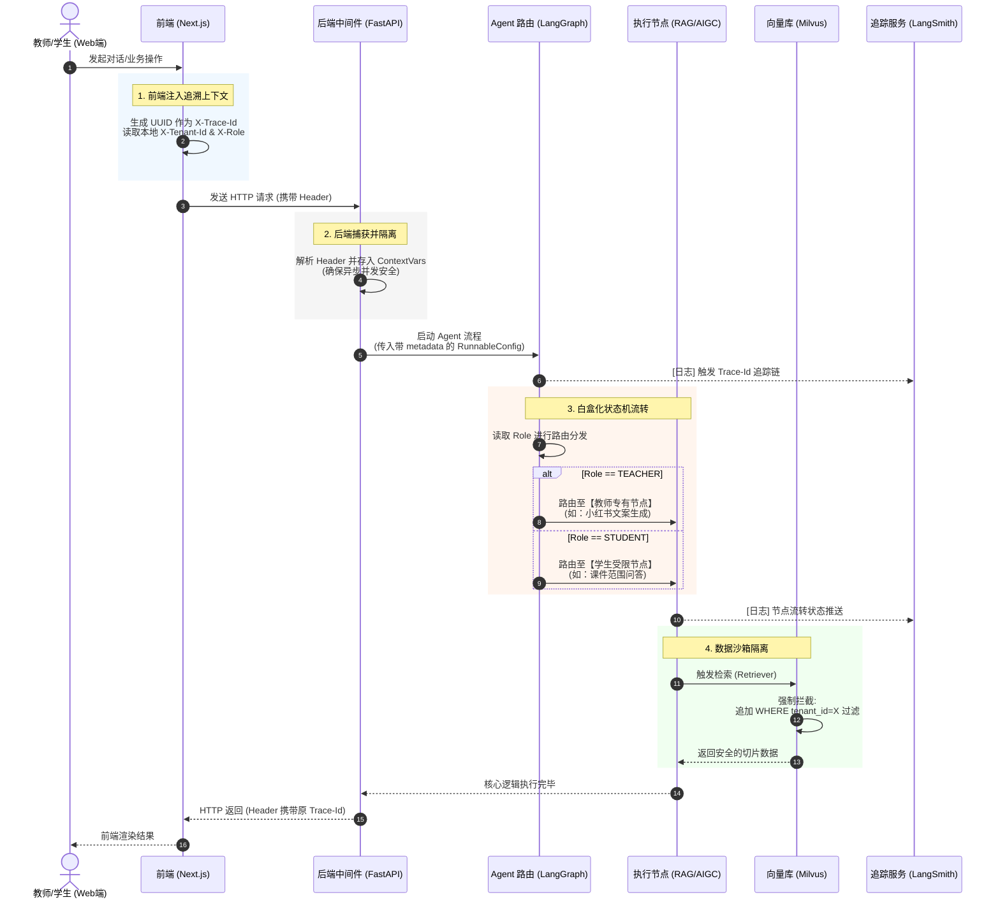

这份文档经过重新设计，专门针对 **Coding Agent**（如 Cursor, AutoGPT, 或自定义 LangChain Agent）进行了结构化优化。它包含了清晰的指令、环境约束、目录结构以及核心代码实现，确保 Agent 能够理解架构意图并实现一键生成。

---

# 技术设计方案：高校教师数字分身系统 (Academic Persona)
**版本：** 1.2.0 (Stable)
**目标：** 构建具备多租户隔离、身份动态切换、全链路追溯能力的 Agent 系统。

---

## 1. 环境约束 (Environment)
* **Runtime:** Python 3.13.11 (Conda environment: `academic_persona`)
* **Backend:** FastAPI + LangChain 1.2.0 + LangGraph
* **Frontend:** Next.js 14+ (App Router) + Tailwind CSS
* **Tracing:** LangSmith (SaaS) + Local Structured Logs
* **Database:** Milvus (Vector) + PostgreSQL (Relational)

---

## 2. 项目目录结构 (Project Structure)
Agent 请严格按照此结构初始化项目：

```text
.
├── backend/                       # 后端工程核心
│   ├── app/
│   │   ├── api/                   # 路由层 (endpoints)
│   │   ├── core/                  # 配置与中间件 (middleware/tracing)
│   │   ├── ai/                    # AI 核心逻辑
│   │   │   ├── agents/            # LangGraph 状态机定义
│   │   │   ├── tools/             # 检索器与工具集
│   │   │   └── prompts/           # 提示词模板
│   │   └── models/                # Pydantic & SQLAlchemy 模型
│   ├── environment.yml            # Conda 环境配置
│   └── main.py                    # 服务入口
└── frontend/                      # 前端工程核心
    ├── src/
    │   ├── app/                   # Next.js App Router
    │   ├── components/            # UI 组件 (Chat/Studio)
    │   └── lib/                   # API 拦截器 (Trace-ID 注入)
    └── package.json
```

---

## 3. 核心架构逻辑可视化
为了帮助你理解请求在多租户环境下的流转与追溯路径，请参考下方的交互式架构图：
整个请求的生命周期与 Trace-ID 透传过程如下：

1. **[前端拦截] 用户发起请求 (Next.js)**
   * 用户在浏览器点击发送。
   * Axios 拦截器启动，生成全局唯一的 `X-Trace-Id`。
   * 从 LocalStorage 读取当前用户的 `X-Tenant-Id` 和 `X-Role`。
   * 将这三个标识强制打入 HTTP Header 并发送请求。

2. **[后端捕获] FastAPI 中间件**
   * 请求抵达后端。
   * 中间件 (`context_middleware`) 拦截请求，解析出 Header 中的三个核心字段。
   * 将它们存入协程安全的上下文变量 (`ContextVar`) 中。

3. **[AI 编排] LangGraph 状态机**
   * 后端构建 `RunnableConfig`，将 `Trace-Id` 塞入 metadata，将 `Role` 塞入 tags。
   * 将 Config 传给 LangGraph。
   * LangGraph 的**路由节点 (Router)** 读取 ContextVar 中的 `Role`：
     * 如果是 `TEACHER`：跳转到 -> [内容生成/作业下发节点]
     * 如果是 `STUDENT`：跳转到 -> [RAG 课件问答节点]

4. **[数据隔离] 向量数据库 (Milvus)**
   * 当执行节点需要查阅知识时，调用 Retriever 工具。
   * Retriever 从 ContextVar 中读取 `Tenant-Id`，并在 SQL/向量搜索语句中强制追加过滤条件 `WHERE tenant_id = 'xxx'`。
   * 确保学生不会查到隔壁班老师的私有课件。

5. **[云端追溯] LangSmith 落盘**
   * 在上述第 3、4 步中，LangChain 底层的 Callback 机制会不断将当前节点的执行状态、耗时、Token 数发送给 LangSmith。
   * 所有的日志都会自动挂载同一个 `Trace-Id`。

---

### Mermaid 纯文本代码版

你可以复制以下代码块中的全部内容：



---

## 4. 后端核心模块实现 (Backend Implementation)

### 4.1 追溯与上下文中间件 (`backend/app/core/tracing.py`)
```python
import uuid
from contextvars import ContextVar
from fastapi import Request

# 协程安全上下文
trace_id_ctx = ContextVar("trace_id", default="")
tenant_id_ctx = ContextVar("tenant_id", default="")
role_ctx = ContextVar("role", default="STUDENT")

async def context_middleware(request: Request, call_next):
    trace_id = request.headers.get("X-Trace-Id", str(uuid.uuid4()))
    tenant_id = request.headers.get("X-Tenant-Id", "default")
    role = request.headers.get("X-Role", "STUDENT")
    
    trace_id_ctx.set(trace_id)
    tenant_id_ctx.set(tenant_id)
    role_ctx.set(role)
    
    response = await call_next(request)
    response.headers["X-Trace-Id"] = trace_id
    return response
```

### 4.2 强追溯 Agent 状态机 (`backend/app/ai/agents/graph.py`)
使用 LangGraph 实现白盒化推理，确保每一个节点执行都能在 LangSmith 中被精确追溯。

```python
from langgraph.graph import StateGraph, END
from langchain_openai import ChatOpenAI
from langchain_core.runnables import RunnableConfig

class AgentState(dict):
    messages: list
    role: str
    tenant_id: str

def node_router(state: AgentState):
    return "teacher_node" if state["role"] == "TEACHER" else "student_node"

def student_qa_node(state: AgentState, config: RunnableConfig):
    # 自动从 config.metadata 获取 trace_id
    # 执行 RAG 检索逻辑
    return {"messages": [{"role": "assistant", "content": "回答..."}]}

def build_graph():
    workflow = StateGraph(AgentState)
    workflow.add_node("student_node", student_qa_node)
    workflow.set_conditional_entry_point(node_router, {"teacher_node": END, "student_node": "student_node"})
    workflow.add_edge("student_node", END)
    return workflow.compile()
```

---

## 5. 前端核心模块实现 (Frontend Implementation)

### 5.1 自动追溯 API 客户端 (`frontend/src/lib/api.ts`)
```typescript
import axios from 'axios';
import { v4 as uuidv4 } from 'uuid';

const client = axios.create({ baseURL: process.env.NEXT_PUBLIC_API_URL });

client.interceptors.request.use((config) => {
  config.headers['X-Trace-Id'] = uuidv4();
  config.headers['X-Tenant-Id'] = window.localStorage.getItem('active_teacher_id');
  config.headers['X-Role'] = window.localStorage.getItem('current_role'); // TEACHER | STUDENT
  return config;
});

export default client;
```

---

## 6. 执行步骤 (Execution Steps)

1.  **Init Environment:**
    `conda env create -f backend/environment.yml`
2.  **Generate Scaffold:**
    根据上述目录结构创建所有空文件夹和 `__init__.py` 文件。
3.  **Core Logic Sync:**
    将第 4、5 节的代码片段写入对应的文件位置。
4.  **Connect Tracing:**
    在环境变量中配置 `LANGCHAIN_TRACING_V2=true` 和 `LANGCHAIN_API_KEY`。
5.  **Verify Flow:**
    启动 FastAPI 后，通过 Swagger 提交请求，观察 `X-Trace-Id` 是否出现在 Response Header 中，并在 LangSmith 后台确认链路完整。

---

**Coding Agent 指令：**
“请按照上述文档结构，首先生成 `backend/environment.yml` 和 `backend/main.py` 的完整基础代码，确保中间件和 LangGraph 的基础路由已打通。”